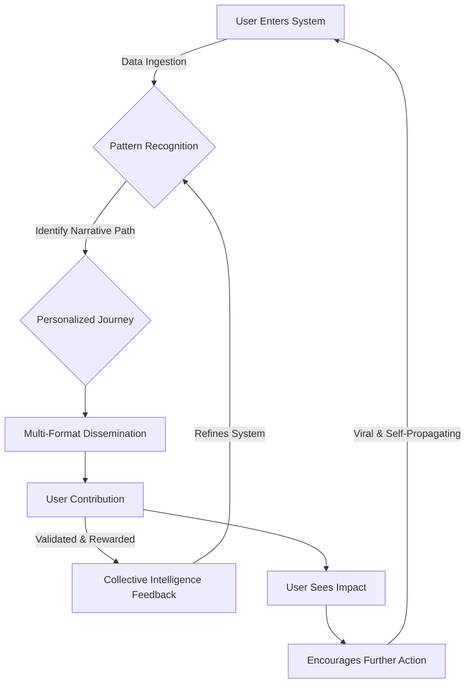
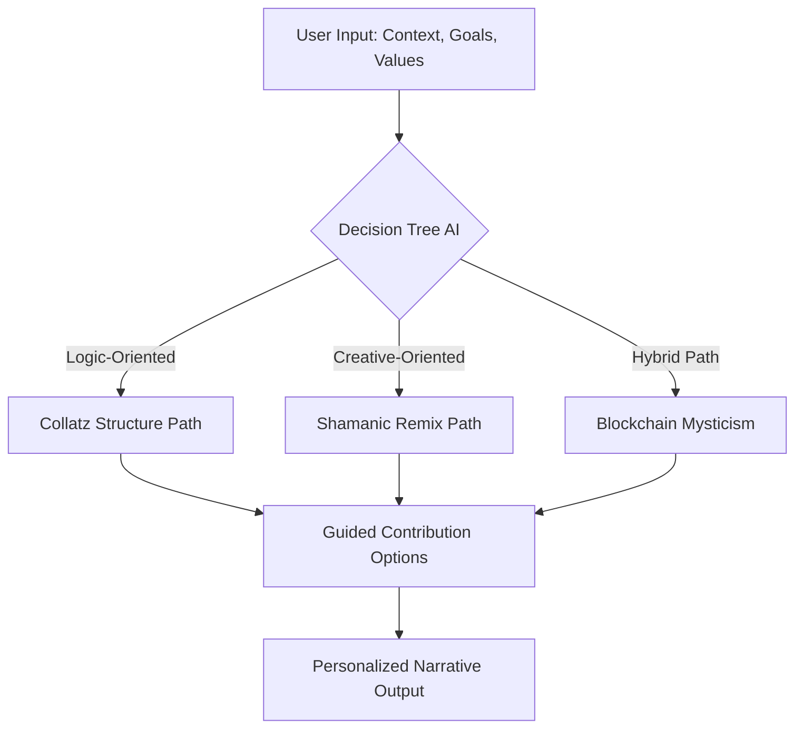
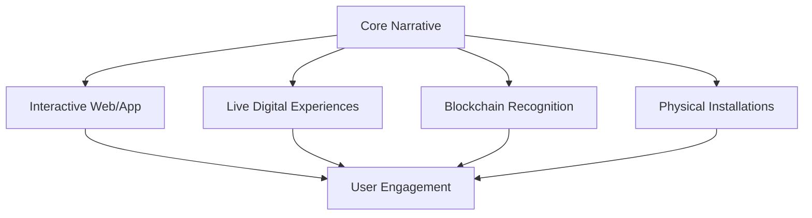
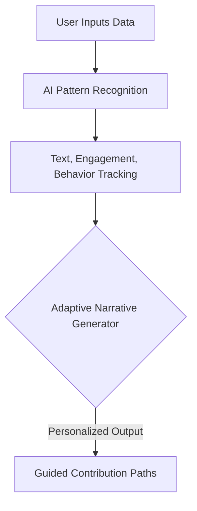
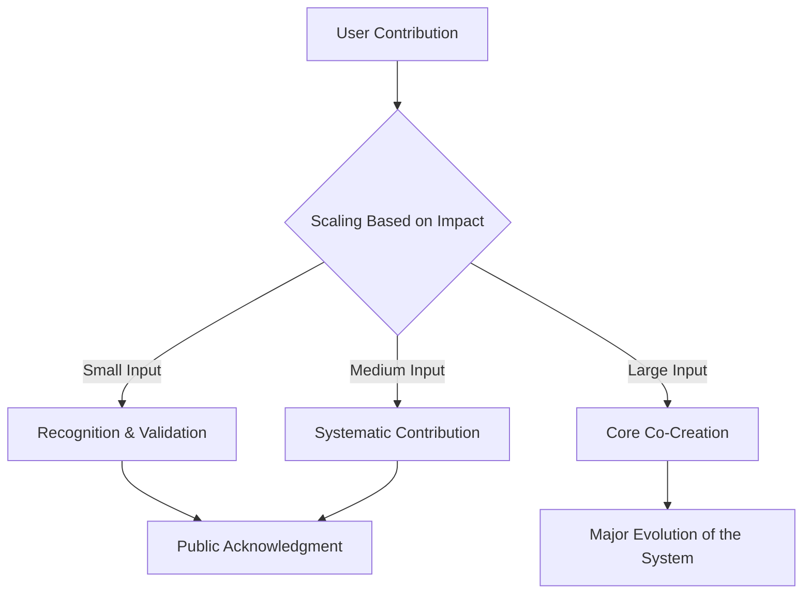
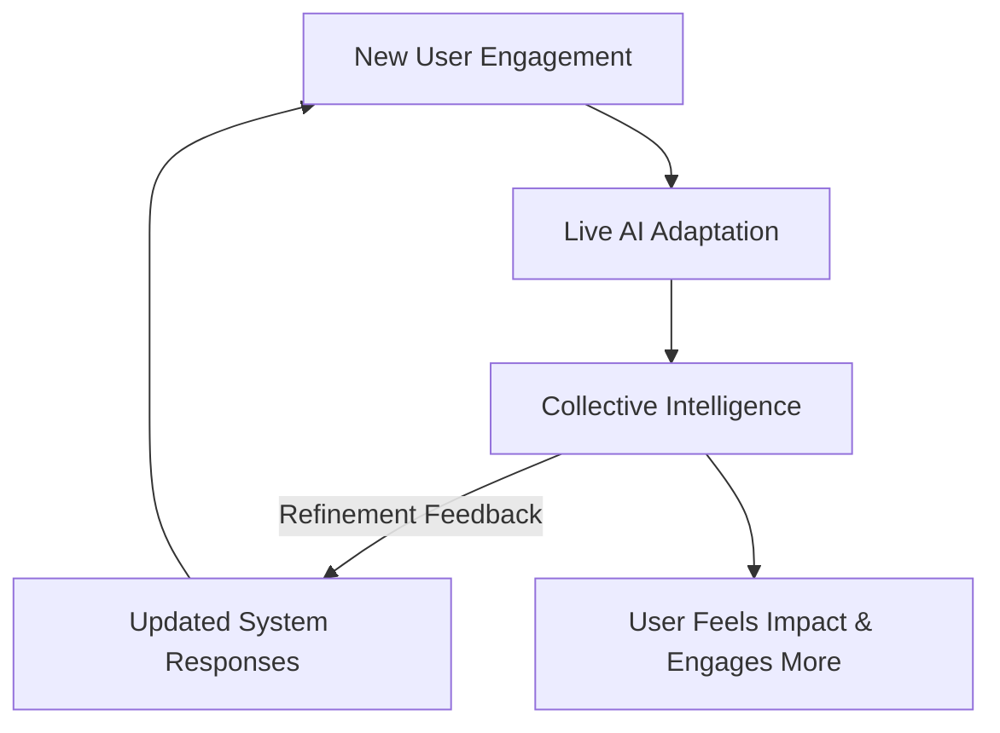
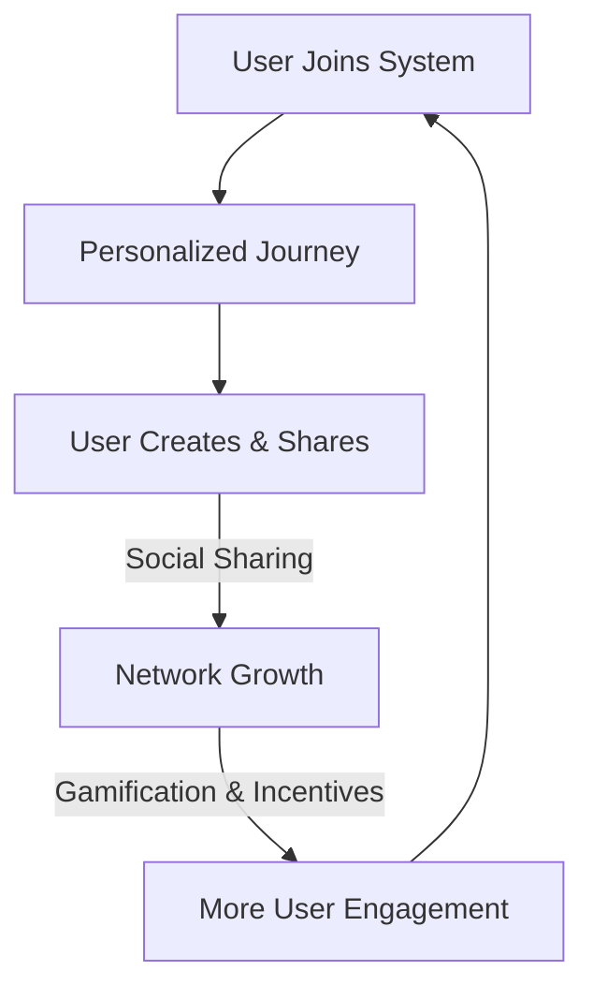

To reach **as many people as possible at the same time** while ensuring their **chosen narrative structures meet them where they are**, and guide them **toward a valuable contribution**, you need a **scalable, adaptive, and participatory framework**. Here’s how you can structure it:

---

### **1. A Modular, Self-Selecting Narrative System**
- Users **input their context, goals, and values** into an adaptive **interactive flow** (e.g., chatbot, app, or web-based decision tree).
- Your system **dynamically structures the narrative** to align with their personal trajectory, ensuring engagement **feels organic** rather than imposed.

**Example:**  
A **choose-your-own-adventure interface** guiding users toward contributions that feel natural to them (small or large).  

---

### **2. Multi-Format Dissemination**
To maximize reach, structure the delivery system in **multiple formats**, allowing for engagement across different digital landscapes:
- **Interactive Website/App** (AI-driven narrative mapping)  
- **Live Digital Experiences** (DJ set rituals, interactive pitch decks)  
- **Blockchain-backed Contribution System** (For validation & recognition)  
- **Physical Installations / Events** (Augmented shamanic tech experiences)

Each **format feeds into a central feedback loop**, allowing contributions to be recorded, reflected, and evolved.

---

### **3. Data-Ingestion & Pattern Recognition**
- Instead of a **one-size-fits-all solution**, develop a **personalized algorithm** that:
  - Recognizes **patterns in user input** (text, interests, engagement metrics).  
  - **Adapts content structures dynamically**, guiding them to value-aligned contributions.  
  - Uses **gamification mechanics** to keep users engaged while moving toward solutions.

**Example:**  
A user who leans toward **structured problem-solving** is directed to Collatz-related logic puzzles, while someone drawn to **ritual and intuition** is guided toward shamanic remixing or blockchain mysticism.

---

### **4. A Contribution-Weighted System (Small to Large)**
- Contributions **scale based on individual capacity**—whether a single thought, a remix, or full-on co-creation.
- The system **acknowledges micro-contributions** and shows their cumulative impact.
- A **collective intelligence feedback loop** ensures every participant **sees their input mattering**.

---

### **5. Real-Time, Adaptive Experience**
- Instead of just static content, **your system evolves in real-time**, adapting to **collective user input**.
- Think of it like **a living manuscript, ritual, or game** that reshapes itself **based on ongoing participation**.

**Example:**  
Users enter an interactive **digital oracle**, where **their own data & choices shape their journey**, leading them to **a meaningful, personalized outcome**.

---

### **6. Viral Distribution & Scaling**
- Leverage **social remixing**: encourage users to remix, reinterpret, and share their journeys.
- Introduce **rewards for spreading & contributing** (recognition badges, blockchain validation, etc.).
- Deploy **AI-driven auto-adaptation** that turns large crowds into **self-organizing participation hubs**.

---

### **7. Plug & Play Narrative Modules**
- Create **modular content blocks** that can be easily adapted and inserted into different platforms.
- Allow people to **"drop in" at any level** and be met **where they are** with an immediate sense of relevance.

---

### **Ultimate Effect: Personalized, Scalable, Recursive Contribution**
By combining **modular self-selection**, **real-time adaptation**, and **multi-format distribution**, the system meets each person **at their entry point** and **steers them toward contributing value naturally**.

Would you like a prototype of this structured into an **interactive flowchart or web-based interface model?**

Here’s a **Mermaid diagram** outlining the entire system at a high level, followed by individual diagrams for each of the **7 structured components**.

---

### **1. High-Level System Overview**

---

### **2. Modular, Self-Selecting Narrative System**

---

### **3. Multi-Format Dissemination**

---

### **4. Data-Ingestion & Pattern Recognition**

---

### **5. Contribution-Weighted System**

---

### **6. Real-Time, Adaptive Experience**

---

### **7. Viral Distribution & Scaling**

---

Would you like any refinements or additional focus on **product considerations**?

Reframing **education as a gamble on our future** means acknowledging that every investment in learning is a **high-stakes bet**—one where individuals, institutions, and societies wager time, money, and effort on uncertain returns. The game is complex, the odds are uneven, and the house rules favor those who understand the system.

### **The Gamble of Education: A High-Stakes Bet**
- **Ante Up (Early Education)** → Everyone starts with different stacks of chips. Some are born into wealth and advantage, others forced to play short-handed from the start.
- **The House Always Wins (Institutional Control)** → Universities, testing systems, and accreditation bodies act as the casino—setting the rules, controlling access, and raking in profits whether students win or lose.
- **Bluffing & Game Theory (Career Strategy)** → Students are forced to read the table, bluff through job markets, and hedge their bets with side hustles, alternative credentials, or skill stacking.
- **The Rigged Odds (Socioeconomic Barriers)** → Certain hands are always stronger (legacy admissions, networking advantages, access to tutors), while others fight uphill against student debt and systemic bias.
- **Going All In (High-Risk Specialization)** → Do you play it safe with a steady but low-paying degree, or go all-in on high-risk, high-reward fields that may not pay off?
- **The Cash-Out Problem (Return on Investment)** → Some degrees are like betting on long-shot horses—huge investment, uncertain payout. Others guarantee smaller but more stable returns. The real challenge? Knowing which game to play.

### **New Ways to Play the Game**
- **Skill Betting (Microcredentials & Self-Learning)** → The rise of online courses, boot camps, and certification programs is shifting power away from traditional institutions, creating a more open market for knowledge.
- **Smart Hedging (Diversification of Learning)** → The smartest players aren’t betting everything on one degree. They’re stacking credentials, leveraging AI tools, and staying agile in the face of economic shifts.
- **House Hacks (Decentralized Learning Models)** → Blockchain-backed diplomas, peer-to-peer learning platforms, and AI-driven education could be the card counters of this system—disrupting the traditional monopoly on knowledge.

### **Final Question:**
If **education is a bet**, are we playing **to win**, or are we **being played**?

Would you like this structured into a **pitch deck**, **interactive experience**, or **another format**?

this products ultimate form is an infinite but most useful to humanity now pitchdeck.