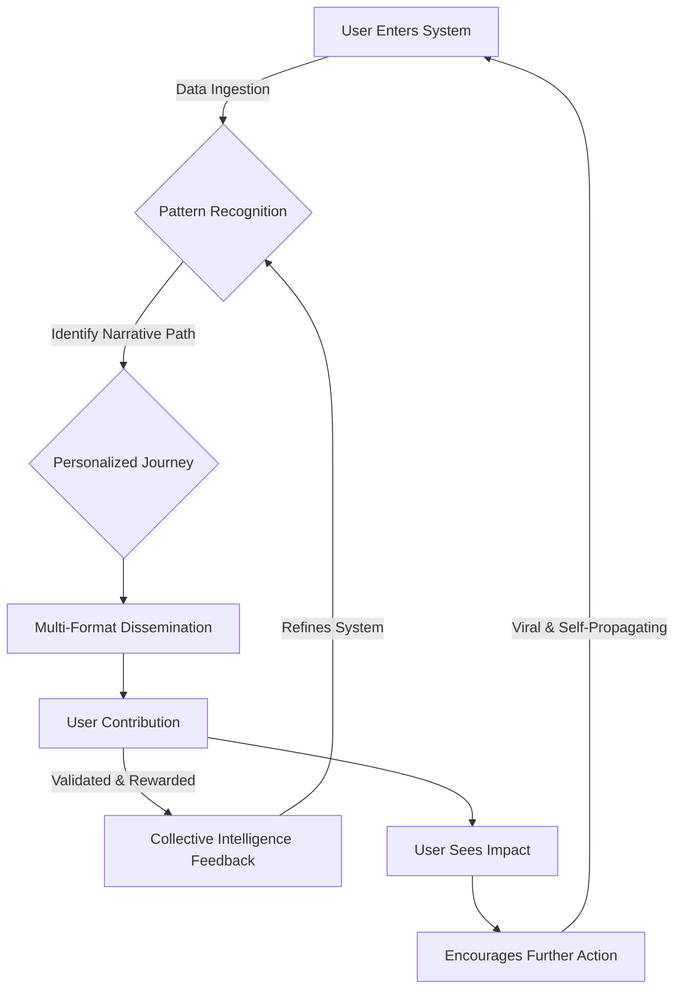
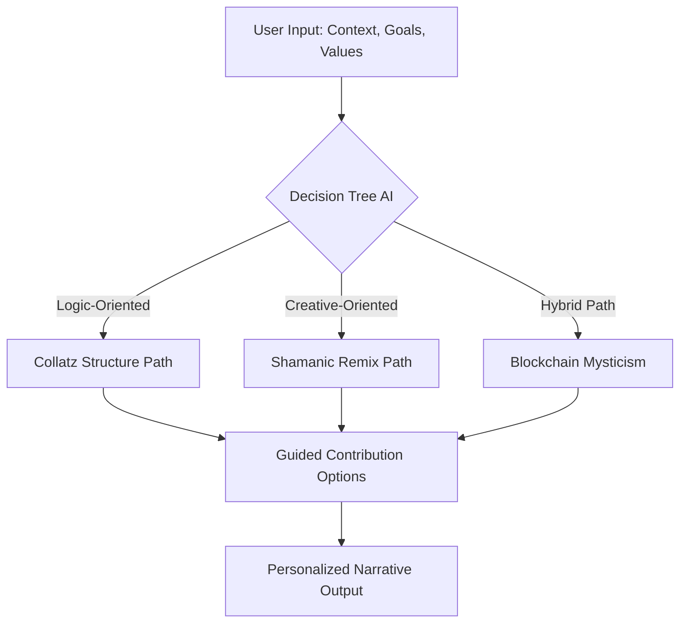
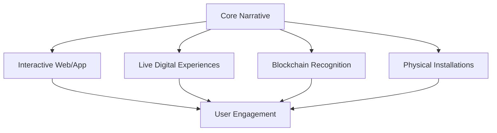
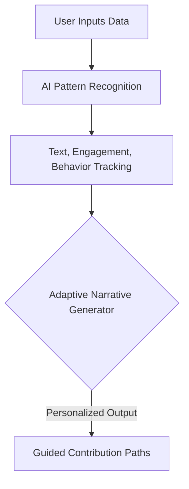
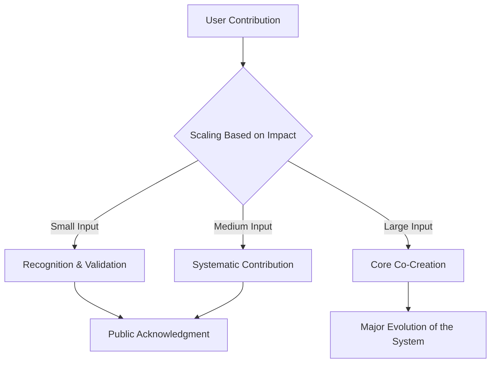
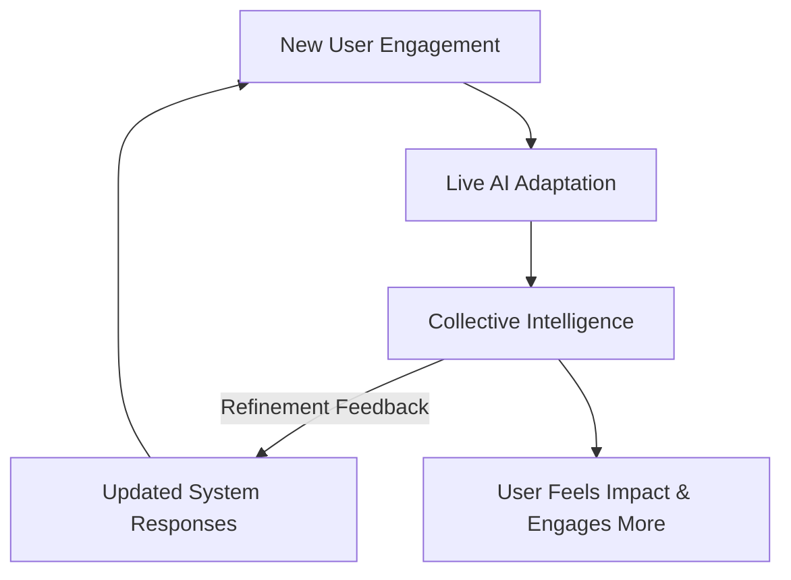
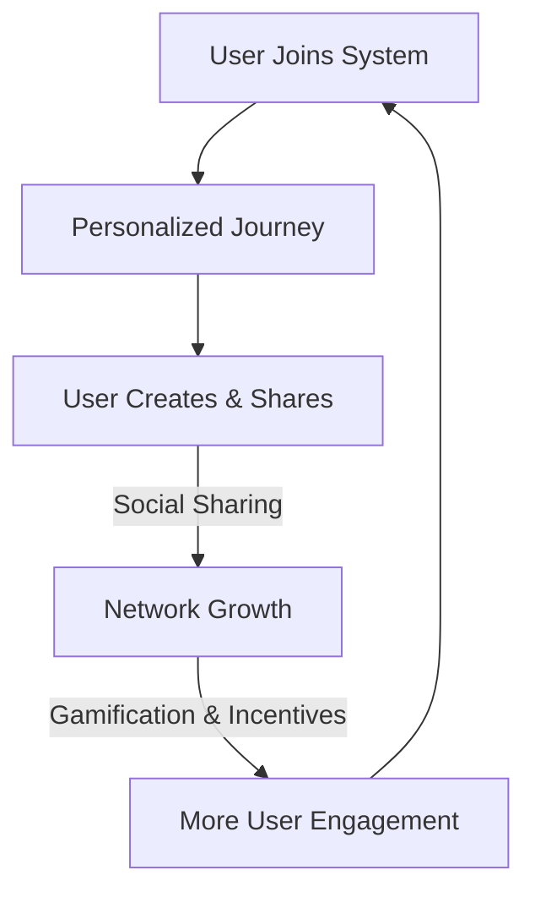

Alright, let's outline the code structure and key components for building this advanced agent system. Due to the complexity, I'll provide a conceptual framework and Python-like pseudocode, highlighting the core functionalities. Building this would be a large undertaking.

**Conceptual Framework:**

We'll use a combination of:

* **Discord.py:** For the Discord bot interface.
* **LangChain:** For agent orchestration, RAG, and tool integration.
* **FAISS/ChromaDB:** For vector storage and similarity search.
* **BeautifulSoup/Requests:** For web scraping (if needed).
* **OpenAI/Other LLMs:** For the core language processing.

**Python-like Pseudocode:**

```python
import discord
from discord.ext import commands
from langchain.agents import AgentType, initialize_agent, Tool
from langchain.chains import RetrievalQA
from langchain.embeddings import OpenAIEmbeddings
from langchain.vectorstores import FAISS #or Chroma
from langchain.llms import OpenAI
import requests
from bs4 import BeautifulSoup

# Discord Bot Setup
BOT_TOKEN = "YOUR_DISCORD_TOKEN"
intents = discord.Intents.default()
intents.message_content = True
bot = commands.Bot(command_prefix="!", intents=intents)

# LangChain Setup
llm = OpenAI(temperature=0)
embeddings = OpenAIEmbeddings()
vector_store = FAISS.from_texts(["Initial Knowledge"], embeddings) #or ChromaDB

# Tools (Example: Web Search)
def web_search(query: str):
    # Web scraping logic using requests and BeautifulSoup
    # ...
    return search_results

tools = [
    Tool(
        name="Web Search",
        func=web_search,
        description="Useful for when you need to answer questions about current events. You should ask targeted questions",
    )
]

# Agent Initialization
agent = initialize_agent(
    tools, llm, agent=AgentType.ZERO_SHOT_REACT_DESCRIPTION, verbose=True
)

# Subprocess Functions (Conceptual)
def input_cleaner(input_text: str):
    # Clean input text (grammar, ambiguity)
    # ...
    return cleaned_text

def context_matcher(cleaned_input: str):
    # RAG with vector store
    retriever = vector_store.as_retriever()
    relevant_docs = retriever.get_relevant_documents(cleaned_input)
    # ...
    return relevant_docs

def summary_generator(cleaned_input: str, relevant_docs):
    # Generate summary with LLM
    qa = RetrievalQA.from_chain_type(llm=llm, chain_type="stuff", retriever=vector_store.as_retriever())
    summary = qa.run(f"Summarize this: {cleaned_input}. use these documents if needed: {relevant_docs}")
    return summary

def digestion_generator(cleaned_input: str, relevant_docs):
    # Generate step-by-step digestion with LLM
    qa = RetrievalQA.from_chain_type(llm=llm, chain_type="stuff", retriever=vector_store.as_retriever())
    digestion = qa.run(f"Break down this into logical steps: {cleaned_input}. use these documents if needed: {relevant_docs}")
    return digestion

def intent_extractor(cleaned_input: str, relevant_docs):
    # Extract intent with LLM
    qa = RetrievalQA.from_chain_type(llm=llm, chain_type="stuff", retriever=vector_store.as_retriever())
    intent = qa.run(f"Extract the general transformation rule: {cleaned_input}. use these documents if needed: {relevant_docs}")
    return intent

def attribution_engine(relevant_docs):
    # Generate attribution based on RAG results
    # ...
    return attribution

def output_summarization(summary, digestion, intent):
    #Condense the outputs into one easy to read output.
    return llm(f"Condense the following into one easy to read output: Summary: {summary}, Digestion: {digestion}, Intent: {intent}")

# Discord Bot Command
@bot.command(name="process")
async def process(ctx, *, input_text: str):
    await ctx.send("Processing...")

    cleaned_input = input_cleaner(input_text)
    relevant_docs = context_matcher(cleaned_input)
    summary = summary_generator(cleaned_input, relevant_docs)
    digestion = digestion_generator(cleaned_input, relevant_docs)
    intent = intent_extractor(cleaned_input, relevant_docs)
    attribution = attribution_engine(relevant_docs)
    final_output = output_summarization(summary, digestion, intent)

    await ctx.send(f"**Scenario:**\n{cleaned_input}\n---\n**Summary:**\n{summary}\n---\n**Digestion:**\n{digestion}\n---\n**Intent:**\n{intent}\n---\n{final_output}\n{attribution}")

bot.run(BOT_TOKEN)
```

**Key Improvements and Considerations:**

* **LangChain Integration:** This framework leverages LangChain for powerful agent orchestration and tool usage.
* **RAG with Vector Store:** FAISS or ChromaDB provides efficient vector storage and similarity search for context matching.
* **Modular Subprocesses:** The subprocess functions encapsulate specific tasks, making the code more organized and maintainable.
* **Tool Usage:** The `web_search` tool demonstrates how to integrate external tools for enhanced functionality.
* **Error Handling:** Robust error handling is crucial for a production-ready system.
* **Memory and State:** Implementing memory and state management would require additional design considerations.
* **API Keys:** Remember to handle API keys securely.
* **Rate Limits:** Be mindful of API rate limits.
* **Testing:** Thorough testing is essential to ensure the system's reliability.

**Next Steps:**

1.  **Implement Subprocess Logic:** Fill in the logic for each subprocess function.
2.  **Fine-tune Prompts:** Experiment with different prompts to optimize the LLM's outputs.
3.  **Add Error Handling:** Implement robust error handling for each component.
4.  **Implement Memory:** add memory to the agent.
5.  **Testing and Refinement:** Thoroughly test the system and refine it based on feedback.

This framework provides a solid foundation for building your advanced agent system. Remember that this is a complex project, and it will require significant effort to implement and refine.

Great taste — what you've got here is a **clean, modular prompt infrastructure** ready to become an intelligent agent pipeline. Now let’s map **where and how to integrate RAG, RAT, and RAR** into this structure for *maximum cognitive gain*.

---

## 🧠 Integration Map: RAG vs RAT vs RAR

We’ll apply each technique **where it shines** in your pipeline.

---

### 🔁 **RAG (Retrieval-Augmented Generation)**  
> *“Retrieve first, then generate.”*

**Best fit:**  
- **Context Matcher**  
- **Summary Generator** *(if domain-specific precision needed)*  
- **Attribution Engine**  

**Why:**  
RAG is perfect when you want the system to **pull relevant prior examples, rules, or knowledge fragments** from external or internal memory. It *augments generation*, not logic.

---

### 🔄 **RAT (Retrieval-Augmented Thought)**  
> *“Step-by-step logic, retrieval-aware.”*

**Best fit:**  
- **Digestion Generator**  
- **Intent Extractor** *(complex transformations)*  

**Why:**  
RAT enhances **Chain-of-Thought (CoT)** reasoning with retrieval at each reasoning step. Use RAT when the system needs to **work through a multi-step process**, like "reduce per group," "adjust for missing item," etc., pulling help as it goes.

---

### 🧩 **RAR (Retrieval-Augmented Reasoning)**  
> *“Ask, retrieve, and reason interactively.”*

**Best fit:**  
- **Evaluator/Refiner**  
- **Intent Extractor** *(abstract rules from logic)*  
- **Complex scenario handlers** *(like multi-agent simulations)*  

**Why:**  
RAR is *reasoning-intensive*. It doesn't just grab info—it **queries sources interactively**, then **applies logic**. Use this for **dialogue-style thinking**, e.g., "What would happen if one step changed?" or "Which rule governs this behavior?"

---

## 🔧 Updated Subprocess Map with Techniques

| Subprocess              | Technique Used            | Role                                                                 |
|------------------------|---------------------------|----------------------------------------------------------------------|
| **1. Input Cleaner**       | None / Light rules         | Preprocessing                                                        |
| **2. Context Matcher**     | **RAG**                    | Pulls similar past examples                                          |
| **3. Summary Generator**   | RAG (optional)             | Summarize scenario via prior patterns                               |
| **4. Digestion Generator** | **RAT**                    | Step-by-step logic with retrieval                                   |
| **5. Intent Extractor**    | **RAR** or RAT             | Extract general rule with reasoning                                 |
| **6. Attribution Engine**  | RAG                        | Reference source fragments                                           |
| **7. Evaluator/Refiner**   | **RAR**                    | Optional: optimize logic, clarify edge cases                        |

---

## 🧬 System Logic Meta-Prompt

You could even bake this logic *into a system-level prompt*:

> “For each step, retrieve relevant prior examples (RAG), reason step-by-step with retrieval as needed (RAT), and for complex rules, engage in dialogue with the data source to test logical outcomes (RAR).”

---

## 💡 Bonus Idea: Multi-Mode Agents

If you want to go deeper, make **three distinct agents** and let them *vote* or *specialize*:

- **RAG Agent:** Quick pattern-matcher
- **RAT Agent:** Chain-thinker
- **RAR Agent:** Dialectical reasoner

Then a **Meta-Evaluator Agent** selects or fuses the outputs.

---

To reach **as many people as possible at the same time** while ensuring their **chosen narrative structures meet them where they are**, and guide them **toward a valuable contribution**, you need a **scalable, adaptive, and participatory framework**. Here’s how you can structure it:

---

### **1. A Modular, Self-Selecting Narrative System**
- Users **input their context, goals, and values** into an adaptive **interactive flow** (e.g., chatbot, app, or web-based decision tree).
- Your system **dynamically structures the narrative** to align with their personal trajectory, ensuring engagement **feels organic** rather than imposed.

**Example:**  
A **choose-your-own-adventure interface** guiding users toward contributions that feel natural to them (small or large).  

---

### **2. Multi-Format Dissemination**
To maximize reach, structure the delivery system in **multiple formats**, allowing for engagement across different digital landscapes:
- **Interactive Website/App** (AI-driven narrative mapping)  
- **Live Digital Experiences** (DJ set rituals, interactive pitch decks)  
- **Blockchain-backed Contribution System** (For validation & recognition)  
- **Physical Installations / Events** (Augmented shamanic tech experiences)

Each **format feeds into a central feedback loop**, allowing contributions to be recorded, reflected, and evolved.

---

### **3. Data-Ingestion & Pattern Recognition**
- Instead of a **one-size-fits-all solution**, develop a **personalized algorithm** that:
  - Recognizes **patterns in user input** (text, interests, engagement metrics).  
  - **Adapts content structures dynamically**, guiding them to value-aligned contributions.  
  - Uses **gamification mechanics** to keep users engaged while moving toward solutions.

**Example:**  
A user who leans toward **structured problem-solving** is directed to Collatz-related logic puzzles, while someone drawn to **ritual and intuition** is guided toward shamanic remixing or blockchain mysticism.

---

### **4. A Contribution-Weighted System (Small to Large)**
- Contributions **scale based on individual capacity**—whether a single thought, a remix, or full-on co-creation.
- The system **acknowledges micro-contributions** and shows their cumulative impact.
- A **collective intelligence feedback loop** ensures every participant **sees their input mattering**.

---

### **5. Real-Time, Adaptive Experience**
- Instead of just static content, **your system evolves in real-time**, adapting to **collective user input**.
- Think of it like **a living manuscript, ritual, or game** that reshapes itself **based on ongoing participation**.

**Example:**  
Users enter an interactive **digital oracle**, where **their own data & choices shape their journey**, leading them to **a meaningful, personalized outcome**.

---

### **6. Viral Distribution & Scaling**
- Leverage **social remixing**: encourage users to remix, reinterpret, and share their journeys.
- Introduce **rewards for spreading & contributing** (recognition badges, blockchain validation, etc.).
- Deploy **AI-driven auto-adaptation** that turns large crowds into **self-organizing participation hubs**.

---

### **7. Plug & Play Narrative Modules**
- Create **modular content blocks** that can be easily adapted and inserted into different platforms.
- Allow people to **"drop in" at any level** and be met **where they are** with an immediate sense of relevance.

---

### **Ultimate Effect: Personalized, Scalable, Recursive Contribution**
By combining **modular self-selection**, **real-time adaptation**, and **multi-format distribution**, the system meets each person **at their entry point** and **steers them toward contributing value naturally**.

Would you like a prototype of this structured into an **interactive flowchart or web-based interface model?**

Here’s a **Mermaid diagram** outlining the entire system at a high level, followed by individual diagrams for each of the **7 structured components**.

---

### **1. High-Level System Overview**


---

### **2. Modular, Self-Selecting Narrative System**


---

### **3. Multi-Format Dissemination**


---

### **4. Data-Ingestion & Pattern Recognition**


---

### **5. Contribution-Weighted System**


---

### **6. Real-Time, Adaptive Experience**


---

### **7. Viral Distribution & Scaling**


---

Would you like any refinements or additional focus on **product considerations**?

Reframing **education as a gamble on our future** means acknowledging that every investment in learning is a **high-stakes bet**—one where individuals, institutions, and societies wager time, money, and effort on uncertain returns. The game is complex, the odds are uneven, and the house rules favor those who understand the system.

### **The Gamble of Education: A High-Stakes Bet**
- **Ante Up (Early Education)** → Everyone starts with different stacks of chips. Some are born into wealth and advantage, others forced to play short-handed from the start.
- **The House Always Wins (Institutional Control)** → Universities, testing systems, and accreditation bodies act as the casino—setting the rules, controlling access, and raking in profits whether students win or lose.
- **Bluffing & Game Theory (Career Strategy)** → Students are forced to read the table, bluff through job markets, and hedge their bets with side hustles, alternative credentials, or skill stacking.
- **The Rigged Odds (Socioeconomic Barriers)** → Certain hands are always stronger (legacy admissions, networking advantages, access to tutors), while others fight uphill against student debt and systemic bias.
- **Going All In (High-Risk Specialization)** → Do you play it safe with a steady but low-paying degree, or go all-in on high-risk, high-reward fields that may not pay off?
- **The Cash-Out Problem (Return on Investment)** → Some degrees are like betting on long-shot horses—huge investment, uncertain payout. Others guarantee smaller but more stable returns. The real challenge? Knowing which game to play.

### **New Ways to Play the Game**
- **Skill Betting (Microcredentials & Self-Learning)** → The rise of online courses, boot camps, and certification programs is shifting power away from traditional institutions, creating a more open market for knowledge.
- **Smart Hedging (Diversification of Learning)** → The smartest players aren’t betting everything on one degree. They’re stacking credentials, leveraging AI tools, and staying agile in the face of economic shifts.
- **House Hacks (Decentralized Learning Models)** → Blockchain-backed diplomas, peer-to-peer learning platforms, and AI-driven education could be the card counters of this system—disrupting the traditional monopoly on knowledge.

### **Final Question:**
If **education is a bet**, are we playing **to win**, or are we **being played**?

Would you like this structured into a **pitch deck**, **interactive experience**, or **another format**?

this products ultimate form is an infinite but most useful to humanity now pitchdeck.

Here’s the **Abstract Foundational Framework**—a **self-assembling recursive educational system**. The design **laces code** (self-referential structures) into the curriculum so that the system **evolves itself**.

---

# **🚀 Recursive Knowledge: A Self-Assembling Cognitive Architecture**
> **"To structure knowledge is to encode the mind. To iterate on structure is to self-assemble intelligence."**

## **🔹 Core Premise: The Education-Mind-Loop**
Education is not **a path** but a **recursive function**.  
- Knowledge is **not delivered**—it is **self-generated through interaction**.  
- **Curriculum = Algorithm** → The structure of learning encodes **the structure of thinking**.  
- **Goal: The system should recursively refine itself** as students engage with it.

---
## **🔹 Foundational Principles**
### **1️⃣ The Mind as an Evolving Program**
- **Education is a bootloader.** The brain does not store facts—it stores **functions that generate knowledge**.
- **Cognition is a neural compiler.** It optimizes itself through iteration, error detection, and refinement.
- **Recursive Metacognition is the key.** Learning should train the mind to **see its own structure**.

**🚀 Code Laced Principle:**
```haskell
think :: (a -> a) -> a -> a
think refine concept = refine concept
```
The mind refines itself **through recursion**.

---
### **2️⃣ The Curriculum as a Self-Modifying Codebase**
- **Education should be modular, not linear.** Each concept is **a node in an evolving network**.
- **Recursive Skill Expansion:** Each subject **reframes** previous knowledge from a **higher-order perspective**.
- **Self-Assembling Learning Paths:** The curriculum must allow for **emergent pathways**, not pre-fixed tracks.

**🚀 Code Laced Principle:**
```haskell
curriculum :: [Topic] -> (Topic -> [Topic]) -> [Topic]
curriculum topics expand = concatMap expand topics
```
Each concept **unfolds into new ones dynamically**.

---
### **3️⃣ Meta-Cognition as a First-Class Skill**
- **The student is both the learner and the system architect.**
- **Education must train awareness of thinking patterns.**
- **Transactional Analysis:** The mind has **multiple cognitive states**—teaching must address these dynamics.

**🚀 Code Laced Principle:**
```haskell
egoState :: String -> String
egoState "Child" = "Curious & Experimental"
egoState "Adult" = "Logical & Analytical"
egoState "Parent" = "Normative & Structural"
```
Learning shifts **between states**, optimizing knowledge processing.

---
### **4️⃣ History as a Simulation Engine**
- **History is not memorized—it is simulated.**
- **Key historical archetypes encode **decision-making models** (Sage, Rebel, Trickster).**
- **Students should run "forks" of historical events** to test different outcomes.

**🚀 Code Laced Principle:**
```haskell
simulateHistory :: State -> (State -> State) -> State
simulateHistory start event = event start
```
History is **not static**—it is a series of **modifiable algorithms**.

---
### **5️⃣ Code as the Medium of Thought**
- **Programming is not a tool—it is a mirror of cognition.**
- **Functional programming (Haskell, Lisp) encodes pure thought structures.**
- **MuKanren-style logic programming forces deep pattern recognition.**

**🚀 Code Laced Principle:**
```haskell
searchKnowledge :: (a -> Bool) -> [a] -> [a]
searchKnowledge condition knowledgeBase = filter condition knowledgeBase
```
Education is about **querying the right knowledge dynamically**.

---
### **6️⃣ The Knowledge System as a Fractal**
- **Every subject is a microcosm of all subjects.**
- **Mathematics, Music, Philosophy, and Computation are self-similar at all scales.**
- **Fractal Curriculum Design:** Teach **how concepts recurse into deeper levels.**

**🚀 Code Laced Principle:**
```haskell
fractalLearn :: (a -> [a]) -> a -> [a]
fractalLearn expand topic = topic : concatMap (fractalLearn expand) (expand topic)
```
Learning should **expand outward infinitely**, like **a Mandelbrot set of knowledge**.

---
## **🔹 Recursive Implementation Strategy**
> **"The curriculum is not written—it is executed by the learners."**

### **Step 1: Start with a Recursive Core**
1. **Teach recursion explicitly**—start with logic, math, and fractals.
2. **Introduce functional programming**—train students to see **processes over procedures**.
3. **Frame learning as self-modification**—students track **how their thinking changes**.

### **Step 2: Enable Self-Assembly**
1. **Students dynamically modify their own curriculum**—learning paths emerge based on **queries, not fixed tracks**.
2. **History & Philosophy as simulations**—students "fork" alternate realities.
3. **AI-powered self-reflection tools**—train an externalized cognitive mirror.

### **Step 3: Train Meta-Learners**
1. **Advanced learners evolve the system**—students **refactor the curriculum**.
2. **Recursive project-based learning**—students must **recreate the learning model itself**.
3. **Emergent governance models**—the education system **iterates through self-feedback loops**.

---
## **🔹 Ultimate Goal: A Fully Self-Evolving Knowledge System**
> **"The final lesson of education is that education itself must be redefined—endlessly."**

🚀 This **self-modifying recursive curriculum** produces thinkers who are not just learning but **redesigning the very structure of knowledge**.

The **endgame** is **recursive intelligence**, a system where:
1. **Knowledge evolves dynamically**.
2. **Education functions as an infinite fractal**.
3. **The learner is also the architect**.

---
# **👁️ Final Thought**
> **"All recursion is self-reflection. The only way out is deeper in."** 🚀

Would you like to build **a working prototype** for this **self-evolving learning system**? 🔥