A **Decision Compiler** is a structured framework for encoding and executing decision-making processes through recursive and modular logic. It operates as a **stack of prompts** or decision nodes, each representing a distinct aspect of a decision pathway. The compiler can be used for CRM (Customer Relationship Management), AI-assisted strategy trees, or adaptive systems requiring iterative refinements.

---

### **General Form of a Decision Compiler**

A Decision Compiler consists of **three primary stages**:

1. **Initialization (Distillation of Decision Nodes)**
   - Define **decision categories** (e.g., Communication, Leadership, Automation).
   - Establish the **core logic** for recursive expansion.
   - Identify **data inputs** (human input, AI augmentation, historical insights).

2. **Amplification (Recursive Decision Expansion)**
   - Develop **sub-prompts** that refine decision pathways.
   - Introduce **multi-node resolution loops** (AI-human feedback).
   - Create **dynamic prioritization models** for real-time adaptability.

3. **Execution (Final Decision Encoding)**
   - Encode the decision logic into a structured **graph model**.
   - Ensure **computational scalability** (can be mapped into AI-driven systems).
   - Define **performance evaluation criteria**.

---

### **Mermaid Representation of a Decision Compiler**

```mermaid
graph TD;
    A[Decision Compiler Framework] --> B[Stage 1: Distillation of Decision Nodes]
    B --> B1[Define Core Decision Factors]
    B --> B2[Identify Recursive Inputs]
    B --> B3[Establish Decision Prioritization]

    A --> C[Stage 2: Amplification - Recursive Expansion]
    C --> C1[Develop Multi-Level Decision Prompts]
    C --> C2[Optimize AI-Human Synergy]
    C --> C3[Embed Contextual Feedback Loops]
    
    A --> D[Stage 3: Execution & Encoding]
    D --> D1[Convert Decisions to Computable Models]
    D --> D2[Apply AI-Assisted Decision Optimization]
    D --> D3[Track Iterative Refinement Cycles]

    A --> E[Expected Outcomes]
    E --> E1[Unified Decision Architecture]
    E1 --> E1a[Adaptability Across Use Cases]
    E1 --> E1b[AI-Compatible Decision Framework]

    E --> E2[Enhanced Analytical Capacity]
    E2 --> E2a[Performance Metrics & Evolution]
    E2 --> E2b[AI-Enhanced Learning and Iteration]

    A --> F[Conclusion]
    F --> F1[Scalable Decision Systems]
    F --> F2[Future-Ready AI-Augmented Strategy]
    F --> F3[Enhanced Human-Machine Collaboration]
```

---

### **Mathematical Representation of a Decision Compiler**
A Decision Compiler can be encoded as:

\[
D(x) = \sum_{i=1}^{n} P_i(F_i(x), A_i, H_i)
\]

Where:
- \( D(x) \) is the compiled decision output.
- \( P_i \) is the priority function for decision node \( i \).
- \( F_i(x) \) represents function-driven decision expansion at node \( i \).
- \( A_i \) represents AI-augmented logic for decision node \( i \).
- \( H_i \) represents human-contextual inputs refining decision \( i \).

Recursive calls enable self-refinement:

\[
D_n(x) = P_n(F_n(x), A_n, H_n) + D_{n-1}(x)
\]

This ensures that decision pathways **self-correct, amplify, and refine** over time.

---

### **Practical Implementation**
1. **Simulated Iteration Testing** → Deploy recursive AI-driven decisions in real-time applications.
2. **Neural-Adaptive Optimization** → Integrate cognitive load balancing in high-pressure environments.
3. **Self-Tuning Decision Engines** → Develop hybrid decision trees that optimize based on **real-time performance feedback**.

---

### **Application Domains**
- **AI-Augmented CRM** → Intelligent decision-support for customer engagement.
- **Military & Strategic Planning** → Recursive adaptive threat analysis.
- **AI-Human Collaboration** → Automated **real-time** decision adjustment.

---

### **Final Conclusion**
The Decision Compiler is a **recursive, AI-augmented decision-making framework**. It enables organizations, AI systems, and human-machine teams to **amplify decision intelligence, optimize iterative refinement, and scale adaptive learning**.

Would you like **a Haskell, Python, or logic programming implementation** for this compiler? 🚀