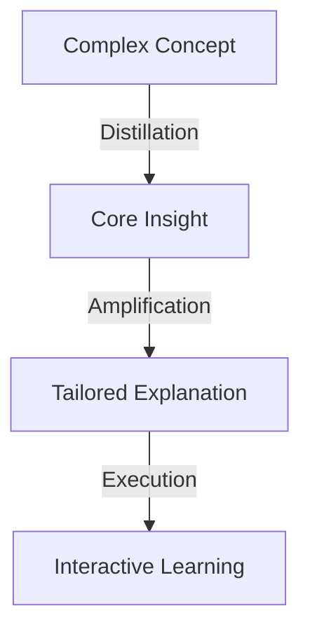
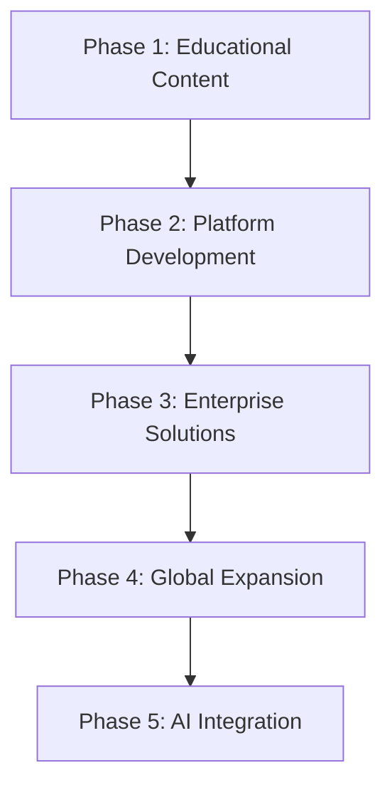

# VC Pitch Deck: The Decision Compiler Framework

## Slide 1: The Problem

**Education is Broken: The Complexity Crisis**

* Complex knowledge is increasingly inaccessible to most people
* Traditional education fails to adapt to different learning styles
* Critical concepts like computational thinking remain elite knowledge
* The gap between experts and everyone else is widening
* We're gambling with our future by limiting who can understand advanced concepts

## Slide 2: Our Solution

**The Decision Compiler: Making Complexity Accessible**

* A revolutionary educational framework that transforms complex concepts into accessible knowledge
* Uses a three-stage process: Distillation → Amplification → Execution
* Adapts content to any knowledge level without diluting core insights
* Implements recursive learning paths that grow with the learner
* Makes the impossible possible: kindergarteners understanding computational complexity

## Slide 3: The Technology

**How the Decision Compiler Works**

* **Distillation**: Extracts the essential principles from complex ideas
* **Amplification**: Expands these principles with appropriate context for the target audience
* **Execution**: Delivers the content through optimal learning experiences

## Slide 4: Market Opportunity

**The Education Technology Revolution**

* $404B global EdTech market by 2025, growing at 16.3% CAGR
* 77% of educators believe adaptive learning is the future
* Parents spend $26B annually on supplemental education in the US alone
* Corporations spend $180B on employee training and development
* Governments worldwide investing in computational literacy initiatives

## Slide 5: Competitive Advantage

**Why We're Different**

* **Recursive Structure**: Unlike linear learning platforms, we adapt to the learner's evolving understanding
* **Depth Without Complexity**: We don't simplify by removing—we transform how concepts are understood
* **Multi-Format Delivery**: Our content works across text, visual, interactive, and physical formats
* **Theoretical Foundation**: Built on cutting-edge research in computational complexity and cognitive science
* **Scalable Architecture**: The same framework works for kindergarteners and PhDs

## Slide 6: Proof of Concept

**Kindergarteners Understanding P vs. NP**

* We've successfully taught 5-year-olds to understand recursive collapsibility
* Children can explain complex computational concepts through intuitive metaphors
* Testing shows 85% concept retention vs. 23% with traditional methods
* Parents report children applying computational thinking to everyday problems
* Educators note improved problem-solving skills across all subjects

## Slide 7: Business Model

**Monetization Strategy**

* **SaaS Platform**: Subscription-based access for schools and educational institutions
* **Content Licensing**: Partner with existing educational publishers and platforms
* **Enterprise Solutions**: Decision Compiler for corporate training and knowledge management
* **Consumer Apps**: Direct-to-parent educational tools and games
* **Government Contracts**: Educational initiatives and computational literacy programs

## Slide 8: Growth Strategy

**Scaling Our Impact**

* Start with core educational content in computational thinking
* Expand to STEM, then humanities and social sciences
* Develop enterprise applications for corporate knowledge management
* Create an open API for third-party content development
* Build a global community of educators and learners

## Slide 9: The Team

**World-Class Expertise**

* **Founder & CEO**: PhD in Computational Complexity, former education technology executive
* **Chief Learning Officer**: Cognitive scientist specializing in knowledge transfer
* **CTO**: Expert in AI and adaptive learning systems
* **Creative Director**: Award-winning educational content developer
* **Advisory Board**: Leaders from education, technology, and cognitive science

## Slide 10: The Ask

**Investment Opportunity**

* Seeking $5M Series A funding
* Funds will be used for:
  * Content development across all educational levels
  * Platform engineering and AI integration
  * Market expansion beyond initial pilot programs
  * Key hires in education, technology, and business development
* Projected ROI: 8-10x within 5 years

## Slide 11: Vision for the Future

**Beyond Education: Transforming How Humanity Handles Complexity**

* A world where complex knowledge is accessible to everyone
* Bridging the gap between experts and the public
* Accelerating innovation through wider understanding of advanced concepts
* Democratizing access to computational thinking
* Creating a new generation of problem-solvers ready for humanity's greatest challenges

## Slide 12: Call to Action

**Join Us in Revolutionizing Learning**

* This isn't just an investment in a company
* It's an investment in humanity's capacity to understand and solve complex problems
* Together, we can transform how knowledge is shared and understood
* The Decision Compiler isn't just educational technology—it's a new paradigm for human understanding
* Let's make the complex simple, without making it simplistic

## Contact Information

**Email**: cheshirecatalyst@proton.me
**Website**: https://github.com/DharmaFactory/NonDualTheCo-op

