A **Decision Compiler** is a structured framework for encoding and executing decision-making processes through recursive and modular logic. It operates as a **stack of prompts** or decision nodes, each representing a distinct aspect of a decision pathway. The compiler can be used for CRM (Customer Relationship Management), AI-assisted strategy trees, or adaptive systems requiring iterative refinements.

---

### **General Form of a Decision Compiler**

A Decision Compiler consists of **three primary stages**:

1. **Initialization (Distillation of Decision Nodes)**
   - Define **decision categories** (e.g., Communication, Leadership, Automation).
   - Establish the **core logic** for recursive expansion.
   - Identify **data inputs** (human input, AI augmentation, historical insights).

2. **Amplification (Recursive Decision Expansion)**
   - Develop **sub-prompts** that refine decision pathways.
   - Introduce **multi-node resolution loops** (AI-human feedback).
   - Create **dynamic prioritization models** for real-time adaptability.

3. **Execution (Final Decision Encoding)**
   - Encode the decision logic into a structured **graph model**.
   - Ensure **computational scalability** (can be mapped into AI-driven systems).
   - Define **performance evaluation criteria**.

---

### **Mermaid Representation of a Decision Compiler**

```mermaid
graph TD;
    A[Decision Compiler Framework] --> B[Stage 1: Distillation of Decision Nodes]
    B --> B1[Define Core Decision Factors]
    B --> B2[Identify Recursive Inputs]
    B --> B3[Establish Decision Prioritization]

    A --> C[Stage 2: Amplification - Recursive Expansion]
    C --> C1[Develop Multi-Level Decision Prompts]
    C --> C2[Optimize AI-Human Synergy]
    C --> C3[Embed Contextual Feedback Loops]
    
    A --> D[Stage 3: Execution & Encoding]
    D --> D1[Convert Decisions to Computable Models]
    D --> D2[Apply AI-Assisted Decision Optimization]
    D --> D3[Track Iterative Refinement Cycles]

    A --> E[Expected Outcomes]
    E --> E1[Unified Decision Architecture]
    E1 --> E1a[Adaptability Across Use Cases]
    E1 --> E1b[AI-Compatible Decision Framework]

    E --> E2[Enhanced Analytical Capacity]
    E2 --> E2a[Performance Metrics & Evolution]
    E2 --> E2b[AI-Enhanced Learning and Iteration]

    A --> F[Conclusion]
    F --> F1[Scalable Decision Systems]
    F --> F2[Future-Ready AI-Augmented Strategy]
    F --> F3[Enhanced Human-Machine Collaboration]
```


---

### **Mathematical Representation of a Decision Compiler**
A Decision Compiler can be encoded as:

\[
D(x) = \sum_{i=1}^{n} P_i(F_i(x), A_i, H_i)
\]

Where:
- \( D(x) \) is the compiled decision output.
- \( P_i \) is the priority function for decision node \( i \).
- \( F_i(x) \) represents function-driven decision expansion at node \( i \).
- \( A_i \) represents AI-augmented logic for decision node \( i \).
- \( H_i \) represents human-contextual inputs refining decision \( i \).

Recursive calls enable self-refinement:

\[
D_n(x) = P_n(F_n(x), A_n, H_n) + D_{n-1}(x)
\]

This ensures that decision pathways **self-correct, amplify, and refine** over time.

---

### **Practical Implementation**
1. **Simulated Iteration Testing** → Deploy recursive AI-driven decisions in real-time applications.
2. **Neural-Adaptive Optimization** → Integrate cognitive load balancing in high-pressure environments.
3. **Self-Tuning Decision Engines** → Develop hybrid decision trees that optimize based on **real-time performance feedback**.

---

### **Application Domains**
- **AI-Augmented CRM** → Intelligent decision-support for customer engagement.
- **Military & Strategic Planning** → Recursive adaptive threat analysis.
- **AI-Human Collaboration** → Automated **real-time** decision adjustment.

---

### **Final Conclusion**
The Decision Compiler is a **recursive, AI-augmented decision-making framework**. It enables organizations, AI systems, and human-machine teams to **amplify decision intelligence, optimize iterative refinement, and scale adaptive learning**.

Implement this compiler in the prompt stack app. 

A mermaid graph should be thought of as describing a sort of system over view, and the layers that an idea should be run by. Distillation to some core prompts is essential. Here is some examples:

The following is an example of such a oneshot:

prompt:
Return three outputs do not perform calculations:

Output 1 (Summary Form): Condense the information into its most essential question or core concept, avoiding specific details.

Output 2 (Digestion Form): Present the key details of the data without interpretation or explanation.

Output 3: (Intent Form):** Describe what the agent intends to do next in response to the question. This should clearly outline the next step in reasoning or action to the query. The response should be explicit and actionable. State only the next step the agent will take, without solving or executing it.

Input: 
There are 3 chalkboards in your classroom. Each chalkboard has 2 pieces of chalk. This means there are 6 pieces of chalk in total. If you take 1 piece of chalk away from each chalkboard, how many will there be in total?

output:

### **Output 1 (Summary Form):**

How does removing 1 item per category affect the total count?

### **Output 2 (Digestion Form):**

- There are **3 chalkboards** in the classroom.
- Each chalkboard has **2 pieces of chalk**.
- The total number of chalk pieces is **3 × 2 = 6**.
- If **1 piece of chalk is removed from each chalkboard**, then:
    - Each chalkboard now has **1 piece of chalk** instead of 2.
    - The new total is **3 × 1 = 3** pieces of chalk.

### **Output 3 (Intent Form):**

Subtract **1 piece of chalk per chalkboard** from the original total and verify the new count.

see how it was run by layers, it could all be in one prompt but if we think about how to break it down, it might be better to model a standard mermaid graph for our operation:

Your **Decision Compiler** is essentially a recursive, modular framework that encodes decision-making into structured **stacked prompts**, refining and optimizing outputs iteratively. This concept is highly applicable in AI-driven decision support, strategy trees, and automation.

## **Analysis of the Decision Compiler Model**
The core strength of the Decision Compiler lies in:
- **Layered Processing** → Breaking down decision-making into distinct computational steps.
- **Recursive Refinement** → Ensuring decisions improve through self-correcting feedback loops.
- **Computational Efficiency** → Can be mapped into AI-assisted decision architectures.
- **Scalability** → Applicable across multiple domains (CRM, strategic AI, optimization models).

Your example prompt ("Return three outputs...") aligns with the Decision Compiler's **structured layering**, breaking decision-processing into:
1. **Summary Form** → Essential question extracted.
2. **Digestion Form** → Key factual elements.
3. **Intent Form** → Explicit next-step decision.

This breakdown represents **distillation, amplification, and execution**, mirroring your framework. It ensures a **clear separation of logical layers**, avoiding unnecessary computation.

---

## **Suggested Solution: Standardizing the Decision Compiler Framework**
To implement this effectively, we should **formalize a standard mermaid graph** that encodes the recursive process. Here's a **Mermaid Graph Model** representing how **layered decision processing** should occur:

### **Mermaid Graph for Decision Compiler Execution**
```mermaid
graph TD;
    A[Decision Compiler System] --> B[Stage 1: Distillation - Core Prompts]
    B --> B1[Extract Essential Question (Summary)]
    B --> B2[Decompose into Key Facts (Digestion)]
    B --> B3[Identify Next Action (Intent)]
    
    A --> C[Stage 2: Amplification - Recursive Refinement]
    C --> C1[Expand Decision Pathways]
    C --> C2[Introduce Feedback Loops]
    C --> C3[Prioritize Adaptive Weighting]

    A --> D[Stage 3: Execution - Final Decision Encoding]
    D --> D1[Convert to Computable Decision Model]
    D --> D2[Automate AI/Human Feedback Integration]
    D --> D3[Optimize for Scalability & Performance]

    A --> E[Application Layers]
    E --> E1[CRM Optimization]
    E --> E2[AI-Assisted Strategic Planning]
    E --> E3[Dynamic Real-Time Decision Making]
```
---
## **Mathematical Model for the Decision Compiler**
Your formula:

\[
D(x) = \sum_{i=1}^{n} P_i(F_i(x), A_i, H_i)
\]

accurately represents the weighted sum of decision nodes, integrating:
- **Recursive decision function** \( F_i(x) \) → Expands based on logical rules.
- **AI-augmented logic** \( A_i \) → Enhances efficiency and automation.
- **Human inputs** \( H_i \) → Provides interpretability and ethical adjustments.

A refinement would be:
\[
D_n(x) = P_n(F_n(x), A_n, H_n) + D_{n-1}(x)
\]
This ensures **each decision refines itself based on prior iterations**, forming a self-correcting tree.

---

## **Standardized Prompt Stack for Decision Compiler**
To fully realize this **layered system**, a prompt structure should be **templated** using a Decision Compiler syntax:

### **General Prompt Template**
```
Prompt:
Given [input], return three structured outputs.

Output 1 (Summary Form): Extract the essential decision focus as a core question.
Output 2 (Digestion Form): List the key factual breakdown of the decision elements.
Output 3 (Intent Form): Identify the next computational step in refining the decision.
```

### **Example Application (AI-Augmented CRM)**
#### **Prompt:**
_A customer has submitted a complaint about delayed delivery. Their order was supposed to arrive in 3 days but has taken 7. They are requesting a refund and compensation._

#### **Output 1 (Summary Form):**
_What is the optimal resolution balancing customer satisfaction and company policy?_

#### **Output 2 (Digestion Form):**
- _Customer expected 3-day delivery, but it arrived in 7._
- _They are requesting a refund and compensation._
- _Company policy allows refunds for delays over 5 days, but no automatic compensation._

#### **Output 3 (Intent Form):**
_Evaluate whether refund eligibility applies and determine if compensation should be discretionary._

---
## **Implementation in AI-Powered Systems**
This Decision Compiler framework can be deployed in:
1. **Automated CRM Decision Agents** → AI evaluates structured customer complaints & returns optimal responses.
2. **Real-Time Strategic AI Engines** → Military decision modeling using recursive adaptation.
3. **Automated Workflow Optimization** → AI processes layered decisions for enterprise automation.

---
## **Conclusion**
The Decision Compiler should be implemented as a **modular AI prompt framework**, ensuring **recursive decision refinement** through structured layers. The standardized **Mermaid Graph Model** and **templated decision prompts** allow seamless application across AI-driven systems. 

TODO: Use this concept to create an educational tool for educators to create ai based pedagogies with, useful also for ai researchers. Think hypercard like, where each state can be chatted with each response is a new state, navigable, like an intentionally driven version of https://github.com/princeton-nlp/tree-of-thought-llm?tab=readme-ov-file with the intent of having marked failed branches available context wise to learn from, while also being able to build on known good knowledge.